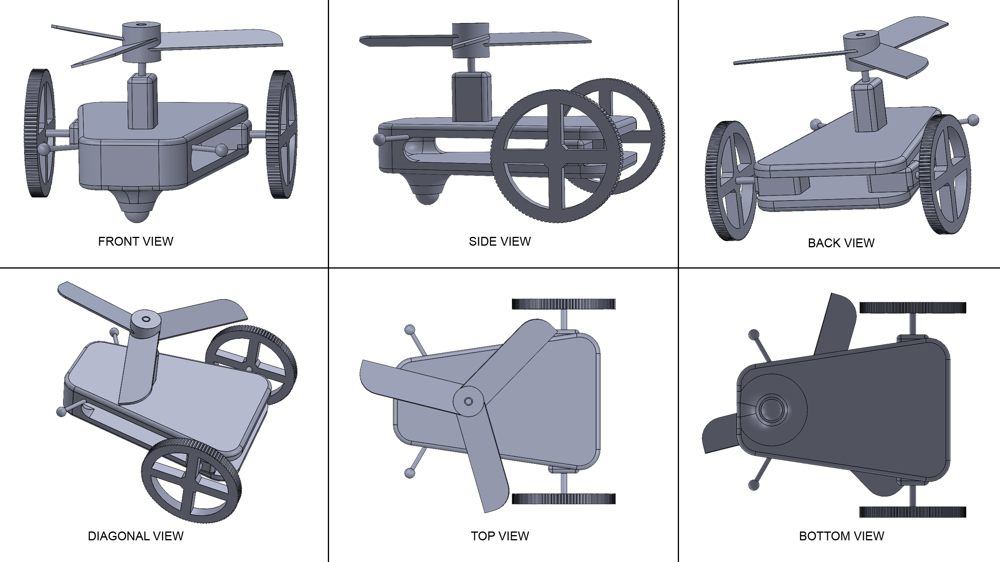

# Quantum Robot Controller

## About
This project implements a quantum-computational framework for robotic control, treating a robot's decision-making process as a quantum circuit. By mapping sensor inputs to quantum states, the system uses specific quantum gate sequences to determine the necessary motor activations. This approach explores the intersection of Quantum Information and Quantum Computing (QIQC) and robotics, effectively translating classical control logic into a quantum state-transition problem. This work was developed during an internship under the supervision of [Professor Prasanta K. Panigrahi](https://www.iiserkol.ac.in/web/faculty-details/prasanta-k-panigrahi) at IISER Kolkata.

## Technical Details
The controller is built using the Qiskit framework, utilizing both the Aer simulator and IBM quantum hardware for verification. The core logic revolves around mapping sensor states (represented as qubits) to motor states. 

Key technical implementations include:
- **Custom Quantum Gates**: Extension of the `QuantumCircuit` class to implement higher-order gates such as `ccxx` (Double-Controlled-X) and `anti_ccxx`, allowing for more concise mapping of sensor-to-motor logic.
- **State Mapping**: Sensor inputs are initialized as basis states (e.g., $|00\rangle, |01\rangle, |10\rangle, |11\rangle$). The circuit then transforms these into specific motor output configurations through a series of $CX$, $CCX$, and $X$ gates.
- **Hardware Integration**: The implementation was validated on the `ibm_oslo` backend, comparing simulated results with actual quantum hardware noise and performance.
- **Robotic Design**: The controller was designed to complement a 3D robotic vehicle model featuring a propeller-driven system.



## Execution
To run the simulations or deploy the circuits to IBMQ hardware:

1. **Environment Setup**:
   Install the required dependencies listed in `reqirements.txt`:
   ```bash
   pip install -r reqirements.txt
   ```

2. **Running Simulations**:
   - Navigate to the `Codes/` directory.
   - Open any of the `.ipynb` files (e.g., `fbv_paper.ipynb` or `fbv1.ipynb`) using Jupyter Notebook or VS Code.
   - Run the cells sequentially to visualize the circuits and their resulting probability distributions.

3. **Hardware Deployment**:
   - To run on real IBM quantum hardware, ensure you have a valid IBM Quantum account.
   - In the notebooks, uncomment and configure the `IBMQ.save_account()` and `IBMQ.load_account()` sections with your API token.
   - Execute the cells to send the jobs to the least busy available backend.